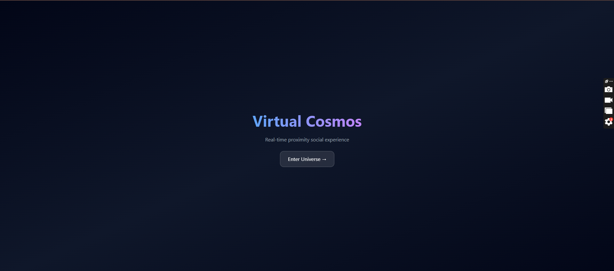
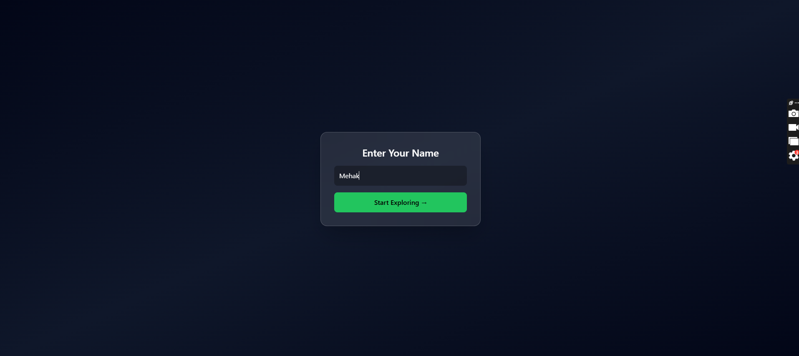
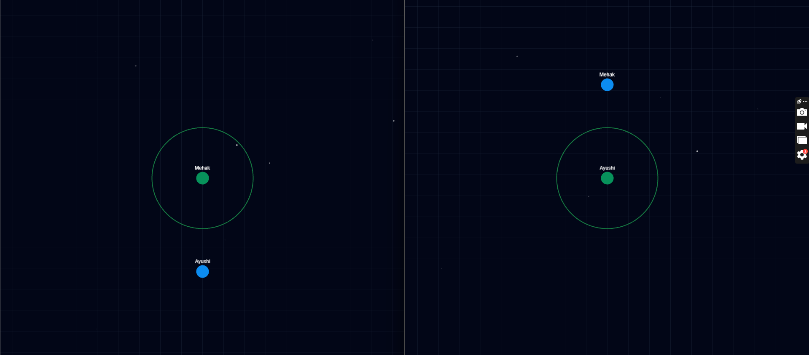
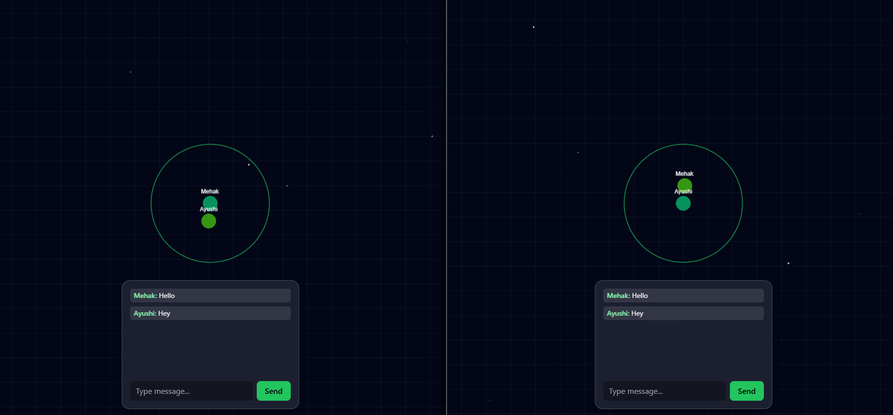

# 🌌 Virtual Cosmos

A real-time 2D proximity-based social space where users interact naturally based on distance — just like in real life.

---

## 🚀 Overview

**Virtual Cosmos** is a multiplayer web application where users move in a shared 2D environment and automatically connect with others nearby.

- Move closer → Chat appears  
- Move away → Chat disappears  

This creates a **spatial, immersive communication experience** similar to real-world interactions.

---

## ✨ Features

### 🎮 Core Experience
- Real-time multiplayer environment
- Smooth WASD / Arrow key movement
- Camera follows player
- Infinite grid + starfield background

### 👥 Player System
- Live player synchronization via WebSockets
- Username displayed above each player
- Smooth interpolation for movement

### 📡 Proximity Logic (Core Feature)
- Distance-based interaction system
- Visual feedback:
  - 🟢 You
  - 🟡 Nearby users
  - 🔵 Distant users
- Dynamic proximity radius indicator

### 💬 Chat System
- Auto-enabled when users are nearby
- Auto-disabled when users move away
- Real-time messaging
- Floating modern chat UI
- Message bubbles above players

### 🎨 UI/UX
- Clean landing page
- Minimal name entry screen
- Glassmorphism chat panel
- Smooth animations
- Modern dark theme

---

## 🛠️ Tech Stack

### Frontend
- React + Vite + TypeScript
- PixiJS (2D rendering engine)
- Tailwind CSS

### Backend
- Node.js + Express
- Socket.IO (real-time communication)
- MongoDB (optional / extendable)

---

## 📂 Project Structure

```bash

virtual-cosmos/
│
├── backend/
│   ├── server.js
│   ├── package.json
│
├── frontend/
│   ├── src/
│   │   ├── components/
│   │   │   ├── GameCanvas.tsx
│   │   │   ├── ChatUI.tsx
│   │   ├── App.tsx
│   │   ├── socket.ts
│   ├── index.html
│   ├── tailwind.config.js
│
└── README.md

```

---

## ⚙️ Setup Instructions

### 1️⃣ Clone the repository

```bash
git clone <your-repo-url>
cd virtual-cosmos
```

---

### 2️⃣ Backend Setup

```bash
cd backend
npm install
npm run dev
```

Server runs on:

```
http://localhost:5000
```

---

### 3️⃣ Frontend Setup

```bash
cd frontend
npm install
npm run dev
```

App runs on:

```
http://localhost:5173
```

---
## 🌍 Live Deployment

### 🚀 Frontend (Vercel)
https://virtual-cosmos-eight.vercel.app/

### 🖥️ Backend (Render)
https://virtual-cosmos-l0ax.onrender.com

---

## ⚙️ Deployment Setup

### Backend (Render)
- Node.js service
- Root directory: `backend`
- Start command: `node server.js`

### Frontend (Vercel)
- Framework: Vite
- Root directory: `frontend`

---

## 🔌 Environment Notes

- Socket.IO connects frontend → backend using deployed URL
- CORS configured to allow Vercel domain

---

## 🧠 How Proximity Logic Works

Each player continuously sends their position to the server.

The frontend calculates distance using:

```
distance = √((x2 - x1)² + (y2 - y1)²)
```

If:

```
distance < PROXIMITY_RADIUS
```

Then:

* Player is considered "near"
* Chat UI becomes active
* Player turns 🟡 yellow

Otherwise:

* Player is "far"
* Chat hides
* Player turns 🔵 blue

---

## 🧪 How to Test

1. Open the app in **2+ browser tabs**
2. Enter different usernames
3. Move players closer together
4. Observe:

   * Color changes
   * Chat appearing/disappearing
   * Real-time sync

---

## 📸 Screenshots

### 🌌 Landing Page


### 🧑 Name Entry


### 🎮 Multiplayer View


### 💬 Chat UI


---

## 🎯 Future Improvements

* 🎤 Voice proximity chat (WebRTC)
* 🧍 Avatar customization
* 🗺️ Multiple rooms / maps
* 🔍 Zoom in/out
* 📱 Mobile support

---

## 🧑‍💻 Author

Built as a full-stack real-time application demonstrating:

* WebSocket architecture
* Game-loop rendering
* Spatial interaction systems
* Modern UI/UX patterns

---
